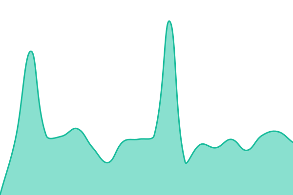
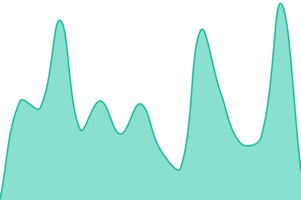
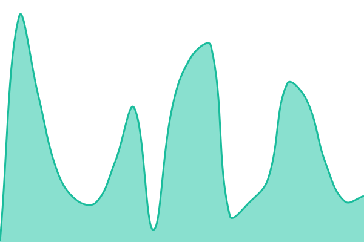
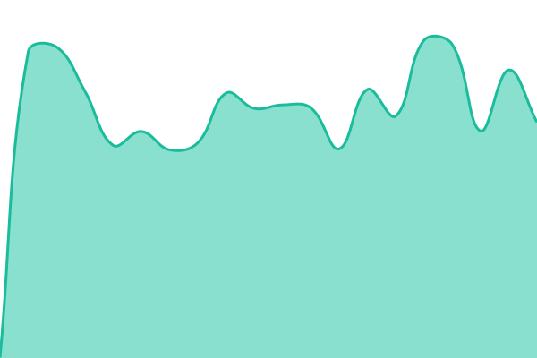
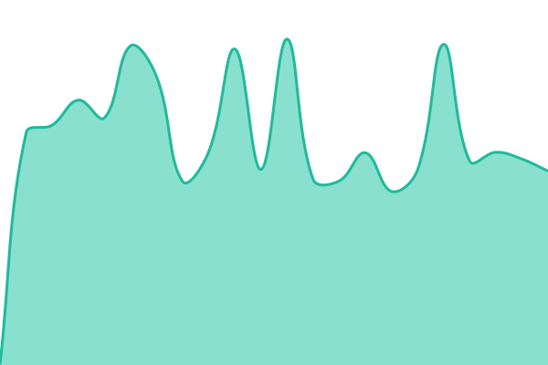
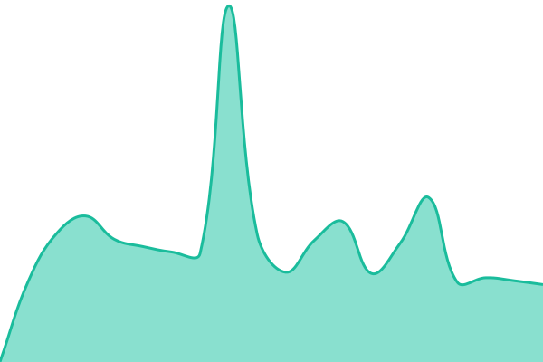
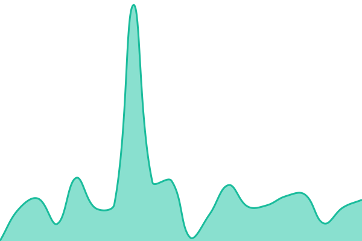
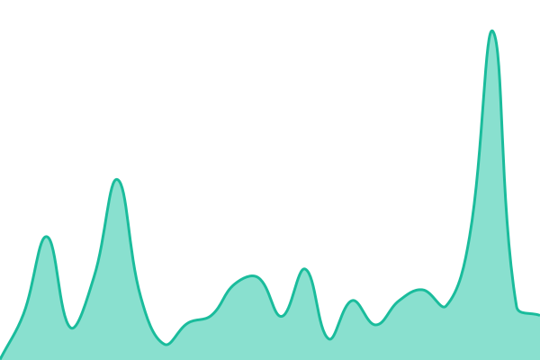
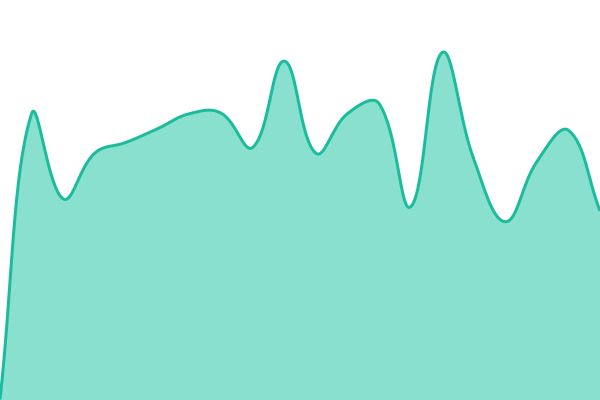
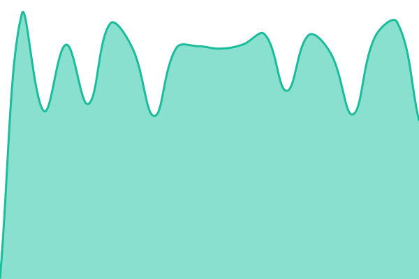

# [📈 Live Status](https://status.homeruntech.io): <!--live status--> **🟧 Partial outage**

This repository contains the open-source uptime monitor and status page for [Homerun Tech](https://status.homeruntech.io), powered by [Upptime](https://github.com/upptime/upptime).

With [Upptime](https://upptime.js.org), you can get your own unlimited and free uptime monitor and status page, powered entirely by a GitHub repository. We use [Issues](https://github.com/homeruntech/upptime/issues) as incident reports, [Actions](https://github.com/homeruntech/upptime/actions) as uptime monitors, and [Pages](https://status.homeruntech.io) for the status page.

<!--start: status pages-->
<!-- This summary is generated by Upptime (https://github.com/upptime/upptime) -->
<!-- Do not edit this manually, your changes will be overwritten -->
<!-- prettier-ignore -->
| URL | Status | History | Response Time | Uptime |
| --- | ------ | ------- | ------------- | ------ |
|  [Armut TR ~ Auth](https://id.armut.com/health_check) | 🟩 Up | [armut-tr-auth.yml](https://github.com/homeruntech/upptime/commits/HEAD/history/armut-tr-auth.yml) | 

 468ms
     
 | 

<a href="https://homeruntech.github.io/upptime/history/armut-tr-auth">99.48%</a>
    

|  [Armut TR ~ Homepage](https://armut.com) | 🟩 Up | [armut-tr-homepage.yml](https://github.com/homeruntech/upptime/commits/HEAD/history/armut-tr-homepage.yml) | 

 144ms
     
 | 

<a href="https://homeruntech.github.io/upptime/history/armut-tr-homepage">99.49%</a>
    

|  [HomeRun CZ ~ Auth](https://id.homerun.co.cz/health_check) | 🟩 Up | [home-run-cz-auth.yml](https://github.com/homeruntech/upptime/commits/HEAD/history/home-run-cz-auth.yml) | 

 763ms
     
 | 

<a href="https://homeruntech.github.io/upptime/history/home-run-cz-auth">99.50%</a>
    

|  [HomeRun CZ ~ Homepage](https://homerun.co.cz) | 🟩 Up | [home-run-cz-homepage.yml](https://github.com/homeruntech/upptime/commits/HEAD/history/home-run-cz-homepage.yml) | 

 474ms
     
 | 

<a href="https://homeruntech.github.io/upptime/history/home-run-cz-homepage">99.51%</a>
    

|  [HomeRun EG ~ Auth](https://id.homerun.com.eg/health_check) | 🟩 Up | [home-run-eg-auth.yml](https://github.com/homeruntech/upptime/commits/HEAD/history/home-run-eg-auth.yml) | 

 492ms
     
 | 

<a href="https://homeruntech.github.io/upptime/history/home-run-eg-auth">99.52%</a>
    

|  [HomeRun EG ~ Homepage](https://homerun.com.eg) | 🟩 Up | [home-run-eg-homepage.yml](https://github.com/homeruntech/upptime/commits/HEAD/history/home-run-eg-homepage.yml) | 

 300ms
     
 | 

<a href="https://homeruntech.github.io/upptime/history/home-run-eg-homepage">99.52%</a>
    

|  [HomeRun HU ~ Auth](https://id.homerun.co.hu/health_check) | 🟩 Up | [home-run-hu-auth.yml](https://github.com/homeruntech/upptime/commits/HEAD/history/home-run-hu-auth.yml) | 

 550ms
     
 | 

<a href="https://homeruntech.github.io/upptime/history/home-run-hu-auth">99.53%</a>
    

|  [HomeRun HU ~ Homepage](https://homerun.co.hu) | 🟩 Up | [home-run-hu-homepage.yml](https://github.com/homeruntech/upptime/commits/HEAD/history/home-run-hu-homepage.yml) | 

 200ms
     
 | 

<a href="https://homeruntech.github.io/upptime/history/home-run-hu-homepage">99.54%</a>
    

|  [HomeRun PL ~ Auth](https://id.homerun.pl/health_check) | 🟩 Up | [home-run-pl-auth.yml](https://github.com/homeruntech/upptime/commits/HEAD/history/home-run-pl-auth.yml) | 

 515ms
     
 | 

<a href="https://homeruntech.github.io/upptime/history/home-run-pl-auth">99.55%</a>
    

|  [HomeRun PL ~ Homepage](https://homerun.pl) | 🟩 Up | [home-run-pl-homepage.yml](https://github.com/homeruntech/upptime/commits/HEAD/history/home-run-pl-homepage.yml) | 

 141ms
     
 | 

<a href="https://homeruntech.github.io/upptime/history/home-run-pl-homepage">99.56%</a>
    

|  [HomeRun RO ~ Auth](https://id.homerun.ro/health_check) | 🟩 Up | [home-run-ro-auth.yml](https://github.com/homeruntech/upptime/commits/HEAD/history/home-run-ro-auth.yml) | 

 523ms
     
 | 

<a href="https://homeruntech.github.io/upptime/history/home-run-ro-auth">99.56%</a>
    

|  [HomeRun RO ~ Homepage](https://homerun.ro) | 🟩 Up | [home-run-ro-homepage.yml](https://github.com/homeruntech/upptime/commits/HEAD/history/home-run-ro-homepage.yml) | 

 196ms
     
 | 

<a href="https://homeruntech.github.io/upptime/history/home-run-ro-homepage">99.57%</a>
    

|  [HomeRun SA ~ Auth](https://id.homerun.com.sa/health_check) | 🟩 Up | [home-run-sa-auth.yml](https://github.com/homeruntech/upptime/commits/HEAD/history/home-run-sa-auth.yml) | 

 587ms
     
 | 

<a href="https://homeruntech.github.io/upptime/history/home-run-sa-auth">99.58%</a>
    

|  [HomeRun SA ~ Homepage](https://homerun.com.sa) | 🟩 Up | [home-run-sa-homepage.yml](https://github.com/homeruntech/upptime/commits/HEAD/history/home-run-sa-homepage.yml) | 

 372ms
     
 | 

<a href="https://homeruntech.github.io/upptime/history/home-run-sa-homepage">99.59%</a>
    

|  [HomeRun UK ~ Auth](https://id.homerun.co.uk/health_check) | 🟩 Up | [home-run-uk-auth.yml](https://github.com/homeruntech/upptime/commits/HEAD/history/home-run-uk-auth.yml) | 

 514ms
     
 | 

<a href="https://homeruntech.github.io/upptime/history/home-run-uk-auth">99.60%</a>
    

|  [HomeRun UK ~ Homepage](https://homerun.co.uk) | 🟩 Up | [home-run-uk-homepage.yml](https://github.com/homeruntech/upptime/commits/HEAD/history/home-run-uk-homepage.yml) | 

 195ms
     
 | 

<a href="https://homeruntech.github.io/upptime/history/home-run-uk-homepage">99.60%</a>
    

|  [ProntoPro AT ~ Auth](https://id.prontopro.at/health_check) | 🟩 Up | [pronto-pro-at-auth.yml](https://github.com/homeruntech/upptime/commits/HEAD/history/pronto-pro-at-auth.yml) | 

 549ms
     
 | 

<a href="https://homeruntech.github.io/upptime/history/pronto-pro-at-auth">99.61%</a>
    

|  [ProntoPro AT ~ Homepage](https://prontopro.at) | 🟩 Up | [pronto-pro-at-homepage.yml](https://github.com/homeruntech/upptime/commits/HEAD/history/pronto-pro-at-homepage.yml) | 

 197ms
     
 | 

<a href="https://homeruntech.github.io/upptime/history/pronto-pro-at-homepage">99.62%</a>
    

|  [ProntoPro CH ~ Auth](https://id.prontopro.ch/health_check) | 🟩 Up | [pronto-pro-ch-auth.yml](https://github.com/homeruntech/upptime/commits/HEAD/history/pronto-pro-ch-auth.yml) | 

 528ms
     
 | 

<a href="https://homeruntech.github.io/upptime/history/pronto-pro-ch-auth">99.63%</a>
    

|  [ProntoPro CH ~ Homepage](https://prontopro.ch) | 🟩 Up | [pronto-pro-ch-homepage.yml](https://github.com/homeruntech/upptime/commits/HEAD/history/pronto-pro-ch-homepage.yml) | 

 161ms
     
 | 

<a href="https://homeruntech.github.io/upptime/history/pronto-pro-ch-homepage">99.64%</a>
    

|  [ProntoPro DE ~ Auth](https://id.prontopro.de/health_check) | 🟩 Up | [pronto-pro-de-auth.yml](https://github.com/homeruntech/upptime/commits/HEAD/history/pronto-pro-de-auth.yml) | 

 515ms
     
 | 

<a href="https://homeruntech.github.io/upptime/history/pronto-pro-de-auth">99.65%</a>
    

|  [ProntoPro DE ~ Homepage](https://prontopro.de) | 🟩 Up | [pronto-pro-de-homepage.yml](https://github.com/homeruntech/upptime/commits/HEAD/history/pronto-pro-de-homepage.yml) | 

 176ms
     
 | 

<a href="https://homeruntech.github.io/upptime/history/pronto-pro-de-homepage">99.65%</a>
    

|  [ProntoPro ES ~ Auth](https://id.prontopro.es/health_check) | 🟩 Up | [pronto-pro-es-auth.yml](https://github.com/homeruntech/upptime/commits/HEAD/history/pronto-pro-es-auth.yml) | 

 443ms
     
 | 

<a href="https://homeruntech.github.io/upptime/history/pronto-pro-es-auth">99.66%</a>
    

|  [ProntoPro ES ~ Homepage](https://prontopro.es) | 🟩 Up | [pronto-pro-es-homepage.yml](https://github.com/homeruntech/upptime/commits/HEAD/history/pronto-pro-es-homepage.yml) | 

 123ms
     
 | 

<a href="https://homeruntech.github.io/upptime/history/pronto-pro-es-homepage">99.67%</a>
    

|  [ProntoPro FR ~ Auth](https://id.prontopro.fr/health_check) | 🟩 Up | [pronto-pro-fr-auth.yml](https://github.com/homeruntech/upptime/commits/HEAD/history/pronto-pro-fr-auth.yml) | 

 469ms
     
 | 

<a href="https://homeruntech.github.io/upptime/history/pronto-pro-fr-auth">99.68%</a>
    

|  [ProntoPro FR ~ Homepage](https://prontopro.fr) | 🟩 Up | [pronto-pro-fr-homepage.yml](https://github.com/homeruntech/upptime/commits/HEAD/history/pronto-pro-fr-homepage.yml) | 

 157ms
     
 | 

<a href="https://homeruntech.github.io/upptime/history/pronto-pro-fr-homepage">99.69%</a>
    

|  [ProntoPro IT ~ Auth](https://id.prontopro.it/health_check) | 🟩 Up | [pronto-pro-it-auth.yml](https://github.com/homeruntech/upptime/commits/HEAD/history/pronto-pro-it-auth.yml) | 

 518ms
     
 | 

<a href="https://homeruntech.github.io/upptime/history/pronto-pro-it-auth">99.70%</a>
    

|  [ProntoPro IT ~ Homepage](https://prontopro.it) | 🟩 Up | [pronto-pro-it-homepage.yml](https://github.com/homeruntech/upptime/commits/HEAD/history/pronto-pro-it-homepage.yml) | 

 207ms
     
 | 

<a href="https://homeruntech.github.io/upptime/history/pronto-pro-it-homepage">99.70%</a>
    

|  [Snowplow collector (Global)](https://collector-snowplow.armut.com/health) | 🟥 Down | [snowplow-collector-global.yml](https://github.com/homeruntech/upptime/commits/HEAD/history/snowplow-collector-global.yml) | 

 380ms
     
 | 

<a href="https://homeruntech.github.io/upptime/history/snowplow-collector-global">100.00%</a>
    

<!--end: status pages-->

[**Visit our status website →**](https://status.homeruntech.io)

## 📄 License

- Powered by: [Upptime](https://github.com/upptime/upptime)
- Code: [MIT](./LICENSE) © [Anand Chowdhary](https://anandchowdhary.com), supported by [Pabio](https://pabio.com)
- Data in the `./history` directory: [Open Database License](https://opendatacommons.org/licenses/odbl/1-0/)
